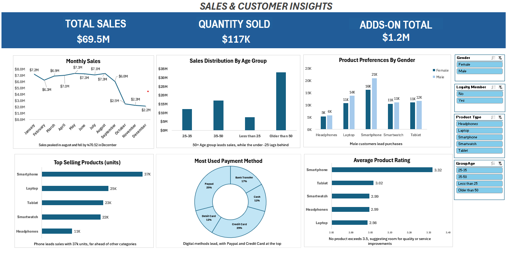
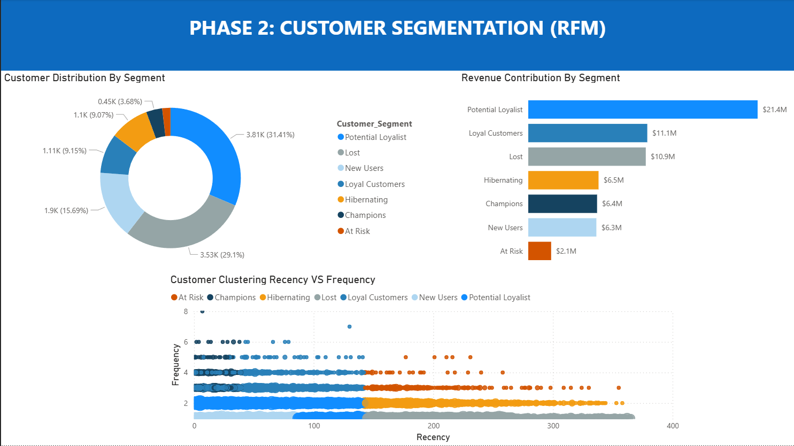

# Electronic Sales Intelligence: From Reporting to RFM Strategy

**Data Analysis Project | End-to-End Solution | Excel & Power BI**


<br>

<details>
<summary><strong>[ES] Versión en Español: Clic aquí para desplegar</strong></summary>

<br>

## 1. Resumen del Proyecto (Evolución)
Este proyecto simula un escenario de negocio real dividido en dos fases estratégicas, analizando un dataset de ventas de electrónicos (20,000 filas, 2023–2024):

* **Fase 1 (Excel):** Análisis Diagnóstico para entender *qué* pasó con las ventas (Tendencias y Productos).
* **Fase 2 (Power BI):** Análisis Estratégico (Segmentación RFM) para identificar *quiénes* son los clientes más valiosos y optimizar la rentabilidad.

---

## 2. Fase 1: Diagnóstico de Ventas (Excel)
**Objetivo:** Limpieza de datos (ETL) y reporte de KPIs fundamentales para responder preguntas de negocio comunes.

### 📉 Hallazgos Clave
* **Insight 1 (Colapso en Q4):** Ingresos estables de Ene-Ago ($7M prom) pero una caída crítica del **70% en Diciembre**.
* **Insight 2 (Riesgo de Producto):** Dependencia masiva de **Smartphones** (37K unidades), vendiendo casi 50% más que la siguiente categoría.
* **Insight 3 (Core Customer):** El grupo de **50+ Años** es el motor financiero, generando el 48% de los ingresos totales ($33M).



➡️ **[Ver Reporte Completo Fase 1 (PDF)](./Hugo_Salinas_Excel_Sales_Analysis_ES.pdf)**

---

## 3. Fase 2: Segmentación Avanzada RFM (Power BI)
**Objetivo:** Migrar de métricas de volumen a métricas de **Rentabilidad y Retención**. Se implementó un algoritmo **RFM (Recencia, Frecuencia, Monto)** para clasificar clientes y asignar estrategias.

### 🛠️ Implementación Técnica
* **Modelado de Datos:** Transformación del dataset plano a un **Esquema de Estrella** (*Star Schema*) con tablas de hechos y dimensiones (`Dim_Customer`, `Dim_Status`, `Dim_Date`).
* **Algoritmo DAX:** Creación de medidas para calcular puntajes (quintiles 1-5) y segmentación dinámica con `SWITCH`.

  ```dax
  Customer_Segment = 
  VAR R = Dim_Customer[R_Score]
  VAR F = Dim_Customer[F_Score]
  VAR M = Dim_Customer[M_Score]

  RETURN SWITCH(TRUE(),
      -- 1. Clientes Top (Champions & Leales)
      R >= 5 && F >= 5 && M >= 5, "Champions",
      R >= 3 && F >= 4, "Loyal Customers",
      
      -- 2. Oportunidad de Crecimiento (Actividad Reciente)
      R >= 3 && F >= 1 && F <= 3, "Potential Loyalist", 
      
      -- 3. Riesgo de Fuga (Prioridad Alta)
      R <= 2 && F >= 4, "At Risk", 
      R <= 2 && F <= 2, "Lost",
      
      "Others" 
  )
  ```

### 🚀 Insight Estratégico
El análisis de Power BI reveló una oportunidad oculta que el promedio de Excel no mostró:
* Aunque el segmento **"Lost"** (Perdidos - barra gris) es grande en volumen, el verdadero motor financiero son los **"Potential Loyalists"** (barra azul brillante).
* **Impacto:** Este grupo genera **$21.4M** en ingresos.
* **Acción:** La estrategia de marketing debe pivotar de intentar "recuperar perdidos" a **fidelizar a los potenciales**, donde el retorno de inversión (ROI) es significativamente mayor.



  ---

## 4. Archivos del Proyecto
  
➡️ **[Descargar Archivo Power BI (.pbix)](./Customer_Segmentation_RFM.pbix)**
  
➡️ **[Descargar Dashboard Excel (.xlsx)](./Sales_Dashboard.xlsx)**

  ---

</details>

<br>

---

## 1. Project Overview (Evolution)
This project simulates a real-world business scenario evolving through two strategic phases, analyzing an electronic sales dataset (20,000 rows, 2023–2024):

* **Phase 1 (Excel):** Diagnostic Analysis to understand *what* happened in sales trends.
* **Phase 2 (Power BI):** Strategic Analysis (RFM Segmentation) to identify *who* represents the most value and optimize profitability.

---

## 2. Phase 1: Diagnostic Analysis (Excel)
**Goal:** Data cleaning (ETL) and reporting of fundamental KPIs to answer common sales questions.

### 📉 Key Findings
* **Insight 1 (Critical Q4 Collapse):** Stable revenue Jan-Aug ($7M avg) followed by a **70% drop in December**, signaling a strategy failure.
* **Insight 2 (Concentration Risk):** Heavy reliance on **Smartphones** (37K units), outselling the next category by nearly 50%.
* **Insight 3 (Core Customer):** The **50+ Age Group** is the financial engine, generating 48% of total revenue ($33M).


➡️ **[View Full Phase 1 Report (PDF)](./Hugo_Salinas_Excel_Sales_Analysis.pdf)**

---

## 3. Phase 2: Advanced RFM Segmentation (Power BI)
**Goal:** Move beyond volume metrics to **Profitability & Retention**. I engineered an **RFM (Recency, Frequency, Monetary)** algorithm to dynamically classify customers.

### 🛠️ Technical Implementation
* **Data Modeling:** Transformed flat data into a **Star Schema** with Fact and Dimension tables (`Dim_Customer`, `Dim_Status`, `Dim_Date`) for performance optimization.
* **DAX Algorithm:** Developed a quintile scoring system (1-5) using `RANKX` and dynamic segmentation logic.

```dax
Customer_Segment = 
VAR R = Dim_Customer[R_Score]
VAR F = Dim_Customer[F_Score]
VAR M = Dim_Customer[M_Score]

RETURN SWITCH(TRUE(),
    -- 1. Top Tier (Champions & Loyal)
    R >= 5 && F >= 5 && M >= 5, "Champions",
    R >= 3 && F >= 4, "Loyal Customers",
    
    -- 2. Growth Potential (Recent Activity)
    R >= 3 && F >= 1 && F <= 3, "Potential Loyalist", 
    
    -- 3. Retention Risks (High Priority)
    R <= 2 && F >= 4, "At Risk", 
    R <= 2 && F <= 2, "Lost",
    
    "Others" 
)
```

### 🚀 Strategic Insight 
The Power BI analysis revealed a hidden opportunity that aggregate data missed:
* While the **"Lost"** segment (Grey bar) is large in volume, the **"Potential Loyalists"** (Bright Blue bar) are the actual financial engine.
* **Impact:** This single group generates **$21.4M** in revenue.
* **Action:** Strategy must shift from trying to recover lost users to **upsizing potential loyalists**, where the ROI is significantly higher.


---

## 4. Project Files & Downloads
Access the deliverables for both phases:

➡️ **[Download Power BI File (.pbix)](./Customer_Segmentation_RFM.pbix)**

➡️ **[Download Excel Dashboard File (.xlsx)](./Sales_Dashboard.xlsx)**

---

## 5. Tools & Skills Demonstrated
* **Microsoft Excel:** Power Query (ETL), Pivot Tables, Dashboarding.
* **Microsoft Power BI:** Data Modeling (Star Schema), DAX Measures (`CALCULATE`, `RANKX`, `SWITCH`), Storytelling.
* **Methodology:** RFM Analysis, Cohort Segmentation, Business Intelligence.